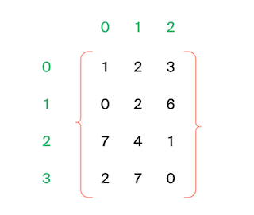

# Соседи

## Условие

Дана матрица. Нужно написать функцию, которая для элемента возвращает всех его соседей. Соседним считается элемент, находящийся от текущего на одну ячейку влево, вправо, вверх или вниз. Диагональные элементы соседними не считаются.

Например, в матрице A соседними элементами для (0, 0) будут 2 и 0. А для (2, 1) –— 1, 2, 7, 7.

### Формат ввода
В первой строке задано n — количество строк матрицы. Во второй — количество столбцов m. Числа m и n не превосходят 1000. В следующих n строках задана матрица. Элементы матрицы — целые числа, по модулю не превосходящие 1000. В последних двух строках записаны координаты элемента, соседей которого нужно найти. Индексация начинается с нуля.

### Формат вывода
Напечатайте нужные числа в возрастающем порядке через пробел.

### Пример
<table><tbody>
  <tr>
    <td><b>Ввод</b></td>
    <td><b>Вывод</b></td>
  </tr>
  <tr>
    <td valign='top'>
4 
3 
1 2 3 
0 2 6 
7 4 1 
2 7 0 
3 
0 

</td>
  <td valign='top'>
7 7 
</td>
  </tr>
</tbody></table>