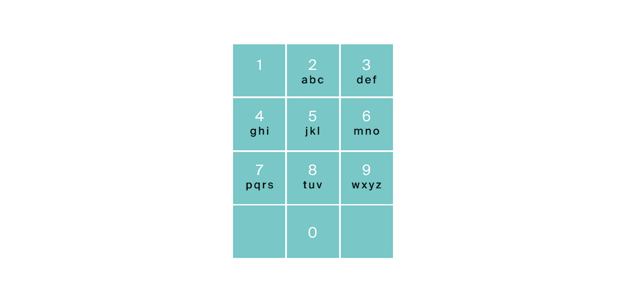

# Комбинации

## Условие
На клавиатуре старых мобильных телефонов каждой цифре соответствовало несколько букв. Примерно так:

2:'abc',
3:'def',
4:'ghi',
5:'jkl',
6:'mno',
7:'pqrs',
8:'tuv',
9:'wxyz'

Вам известно в каком порядке были нажаты кнопки телефона, без учета повторов. Напечатайте все комбинации букв, 
которые можно набрать такой последовательностью нажатий.

### Формат ввода
На вход подается строка, состоящая из цифр 2-9 включительно. Длина строки не превосходит 10 символов.
### Формат вывода
Выведите все возможные комбинации букв через пробел.
### Пример
<table><tbody>
  <tr>
    <td><b>Ввод</b></td>
    <td><b>Вывод</b></td>
  </tr>
  <tr>
    <td valign='top'>
23 

</td>
  <td valign='top'>
ad ae af bd be bf cd ce cf 

</td>
  </tr>
</tbody></table>